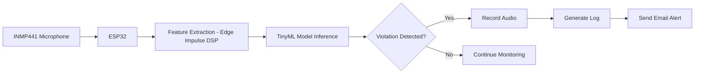
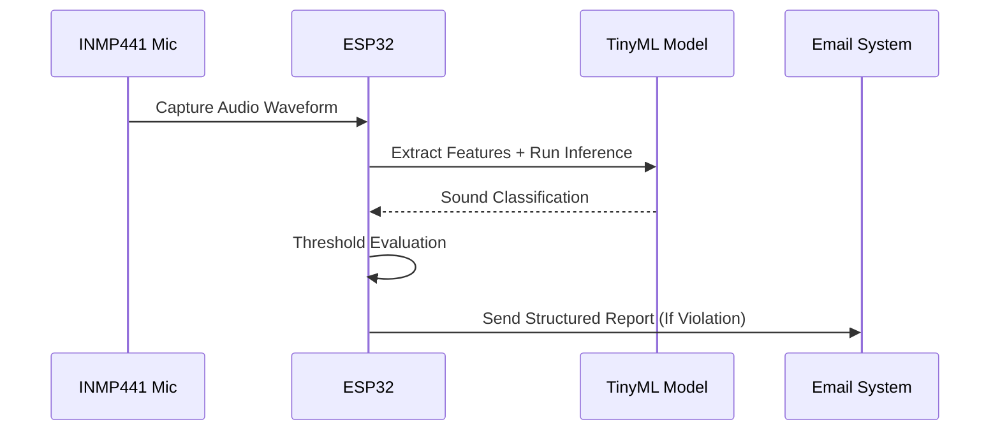

# 🎧 AI-Driven Edge Monitoring and Compliance System

A real-time **Edge AI-based environmental sound classification system** built on ESP32 using TinyML.
Detects policy-violating noise events, logs structured evidence, and triggers automated compliance alerts — all without cloud dependency.

---

# 📌 Problem Statement

In residential societies, excessive party noise often disturbs families.
However, lack of recorded evidence makes formal complaints difficult.

This system solves that by:

* Classifying environmental sounds
* Detecting threshold violations
* Recording evidence
* Generating structured logs
* Sending automated email alerts

---

# 🏗 System Architecture

---

# ⚙️ Workflow Overview

---

# 🔬 Dataset & Training

* 40,000+ custom-labeled audio waveform samples
* Classes:

  * 🎉 Party Music
  * 🗣 Talking
  * 🚧 Construction
  * 🔇 Silence
* Data preprocessing and mapping using Python
* Model trained and optimized using Edge Impulse

---

# 📊 Performance Metrics

| Metric                  | Value           |
| ----------------------- | --------------- |
| Classification Accuracy | 90%             |
| Model Size              | 14KB            |
| Inference Latency       | 5ms             |
| Peak RAM Usage          | 9.5KB           |
| Flash Usage             | 63KB            |
| Dataset Size            | 40,000+ Samples |

---

# 🧠 Optimization Strategy

* Model quantization for memory efficiency
* Feature extraction optimized for embedded execution
* Threshold-based filtering to reduce false alerts
* Fully offline inference (no cloud dependency)
* Memory-aware firmware design in Arduino (C++)

---

# 🛠 Hardware Components

* ESP32 Microcontroller
* INMP441 I2S MEMS Microphone
* WiFi-based SMTP communication

---

# 💻 Software Stack

* Python – Data preprocessing & dataset preparation
* Edge Impulse – Model training & TinyML deployment
* Arduino (C++) – Firmware & embedded logic
* SMTP – Email alert automation

---

# 🚀 Key Highlights

✔ Real-time on-device inference
✔ Ultra-low memory footprint
✔ Compliance-style structured reporting
✔ Edge AI deployment under strict constraints
✔ Practical TinyML production system

---

# 📈 Potential Extensions

* Distributed multi-device monitoring
* Real-time dashboard
* Adaptive noise thresholds
* Cloud-based analytics integration
* Mobile notification system

---

Tell me which style you want next 🔥
